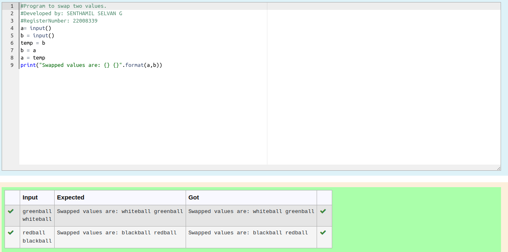

# Circulate-the-values-of-N-variables
## Aim:
To write a python program for swapping of two values
## Equipment’s required:
PC Anaconda - Python 3.7

## Algorithm: 
### Step 1: 
Get the two values from the user

### Step 2: 
Assign the value of second variable to a temporary variable

### Step 3: 
Assign the value of the first variable to the second variable

### Step 4: 

Assign the value in temporary variable to the first variable

### Step 5: 
Print both the values it would be interchanged
### Step 6: 
End the program

## Program:
```
#Program to swap two values
#Developed by: G.SENTHAMIL SELVAN
#RegisterNumber:22008339
n1= input()
n2= input()
temp=n2
n2=n1
n1= temp
print("Swapped values are: {} {}".format(n1,n2))
```
## Output:


## Result:
Thus the swapping of two values are successfully executed
